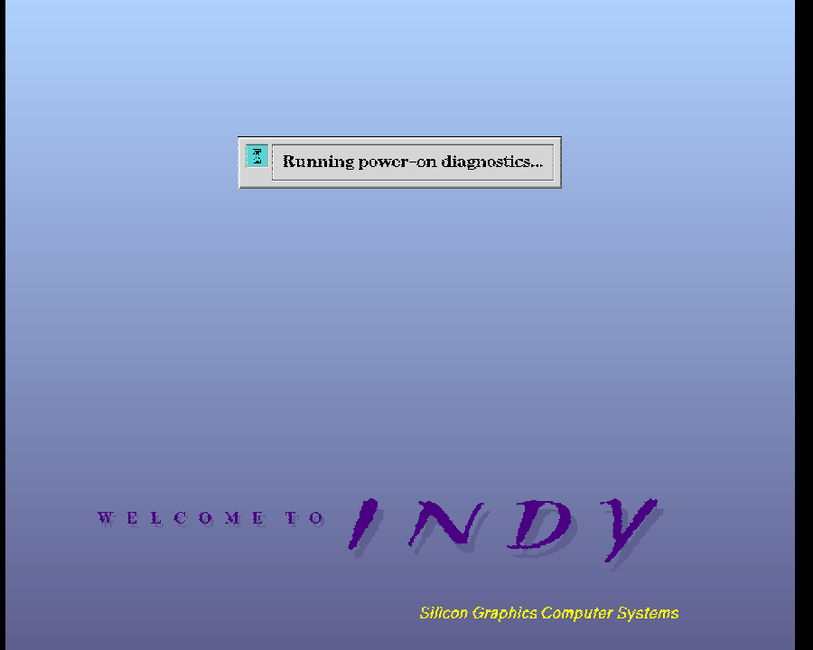

# SGI workstation core for MiSTer

An in-progress MiSTer FPGA core for the **SGI Indy (IP24, R4x00)**, using the
MiSTer N64 project's R4300i CPU.

**Status: it runs on a DE10-Nano.** The real IP24 PROM boots, draws the Indy
boot screen through Newport, and reaches the System Maintenance Menu.



**This is early.** It draws and it boots; it is not yet a machine you can use.
No IRIX, no mouse pointer, no sound, no network, and nothing you change
survives a reset. If you want to try it, read
[`docs/20-releases.md`](docs/20-releases.md) first — it says what each build
does and does not do, and the install has one step that fails silently if you
skip it.

| | |
|---|---|
| Hardware | Boots to the System Maintenance Menu on a DE10-Nano. Slow to paint the screen — give it a minute |
| Video | 1318 x 1024, the PROM's own timing table, about 14 Hz |
| PROM boot | POST passes, `hinv`, keystrokes over SCC tty1 (under Verilator) |
| Graphics | Newport REX3/VC2/XMAP9/CMAP/BT445. No cursor, no overlays |
| CPU | 240-test MIPS III/IV suite, **2161 checks passed, 3 failed** (IRIS's own R4400: 2101 / 61) |
| Fit | **30,611 / 41,910 ALMs (73%)**, 294/553 M10K, timing met on every clock |

Everything except the first two rows is measured under Verilator. The fit is
Quartus 17.0.2 Lite on a `5CSEBA6U23I7`.
[`docs/18-mister-integration.md`](docs/18-mister-integration.md) is the top
level and what is still wrong with it.

```sh
tests/run-prom.sh         # boot the real PROM to the Command Monitor, ~50 s
tests/run-newport.sh      # the graphics board
tests/run-cputest.sh      # the CPU suite, ~35 s
tests/run-scc.sh          # the SCC, ~4 s
```

## Installing on a MiSTer

Take the newest pair from [`releases/`](releases/) and put them here:

```
/media/fat/_Computer/SGIIndy_<date>.rbf     the core
/media/fat/games/SGIIndy/boot.rom           the PROM
```

**You have to create `games/SGIIndy` yourself, and it has to be spelled that
way.** MiSTer does not create it, and a missing directory is not an error - it
is a machine with no firmware, which looks like a core that does nothing. The
name is the one in `CONF_STR`, which is how the framework finds the PROM.

`boot.rom` is in the repository root — it is `ip24prom.070-9101-011.bin`, PROM
Monitor 5.3, under the name MiSTer's framework looks for. Main uploads any file
called `boot.rom` from the core's directory at startup, so the machine comes up
with firmware without touching the OSD. The OSD's **Load PROM** replaces it by
hand.

Bring it up for the first time with **Graphics board: None**. The console then
goes to the board's UART pins and you get the serial boot to the Command
Monitor, which is far easier to read than a screen that may not be there yet.

## Where to start

[`docs/README.md`](docs/README.md) indexes everything.
[`docs/10-r4300-integration.md`](docs/10-r4300-integration.md) is the CPU as
built — the byte-lane contract, what it takes to turn an R4300 into an R4400,
the bugs fixed in the vendored core, and the numbers. If you are picking this work up,
[`docs/08-resume-prompt.md`](docs/08-resume-prompt.md) is the entry point.

## Layout

| Path | Contents |
|---|---|
| `sgiindy.sv` | MiSTer top level — hps_io, PLL, DDR3 mux, PROM download, video out |
| `boot.rom` | PROM Monitor 5.3, under the name the MiSTer framework auto-loads |
| `rtl/mister/` | `ddr3_mux.sv` (five masters into one DDR3 window), `fb_linecache.sv` |
| `rtl/sgi/` | `sgi_indy.sv` (the core), the SCC; MC, HPC3, INT2, DS1386, HAL2 to come |
| `rtl/cpu/` | the CPU: vendored R4300i VHDL made to present as an R4400, Altera-primitive stand-ins, the bus adapter |
| `rtl/newport/` | Newport graphics — REX3, VC2, two XMAP9, two CMAP, BT445 |
| `sys/` | MiSTer framework, from the upstream template |
| `verilator/` | headless simulation harness |
| `tests/` | the CPU and SCC regressions, and their reference logs |
| `tools/` | VHDL→Verilog lowering, upstream diff, PROM tooling |
| `releases/` | built bitstreams by date, and the PROM to go with them |
| `scripts/` | build, deploy to a MiSTer, screenshot, read its memory |
| `docs/` | design notes, address maps, PROM analysis, port plan, release history |
| `roms/` | boot PROM images for IP12/IP20/IP22/IP24 — SGI firmware, see `NOTICE.md` |
| `reference/` | chip specs, full PROM disassembly, MAME sources (**gitignored**) |

## Building

Quartus 17.0.x (or 13.x via `sgiindy_Q13.qpf`), per the standard MiSTer flow.
Quartus compiles the CPU's VHDL directly; there is no checked-in netlist.

Simulation needs Verilator, GHDL (to lower the VHDL for Verilator only) and a
big-endian MIPS cross compiler:

```sh
brew install verilator ghdl
brew install messense/macos-cross-toolchains/mipsel-unknown-linux-gnu
make -C verilator cputest
```

The `mipsel` cross GCC is bi-endian; `-EB -mabi=n32` gets the ELF32 MSB image
the tests want, which is what makes this work on macOS at all.

## Licence

**GPL-3.0** — see [`NOTICE.md`](NOTICE.md). The core vendors the MiSTer N64
project's GPL-3.0 CPU, so it cannot be GPL-2.0-only; MiSTer's `sys/` is
"v2 or later", which makes that legal.

## Credits

- MiSTer framework and core template: the MiSTer-devel project.
- R4300i CPU: the MiSTer N64 project (`MiSTer-devel/N64_MiSTer`), GPL-3.0.
  `rtl/cpu/r4300/UPSTREAM.md` records every local change.
- The DE1-based SGI reverse-engineering sandbox this work builds on: OzOnE.
- IRIS, the Rust SGI Indy emulator, used as the behavioural oracle and as the
  source of the bare-metal MIPS III/IV CPU test suite.
- MAME's `indy_indigo2` driver, used as a further cross-reference.
- aoR3000 R3000A core: Aleksander Osman (BSD) — the documented fallback for an
  Indigo/IP12 target.

Boot PROM images under `roms/`, and the copy of one at `boot.rom`, are
copyrighted SGI firmware and are not covered by this repository's licence. See
[`NOTICE.md`](NOTICE.md).
